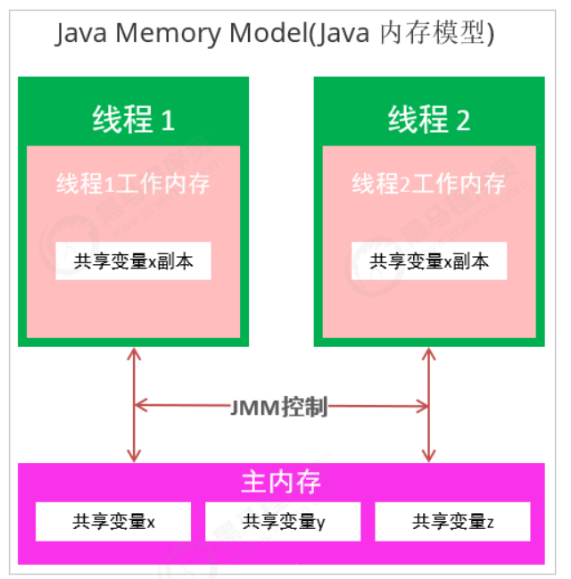
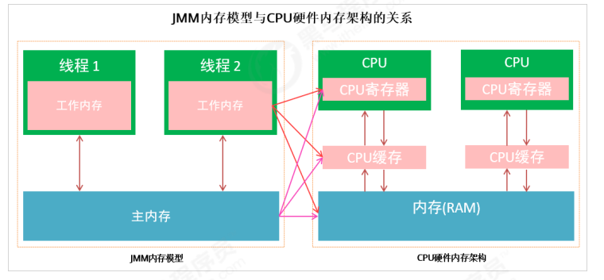
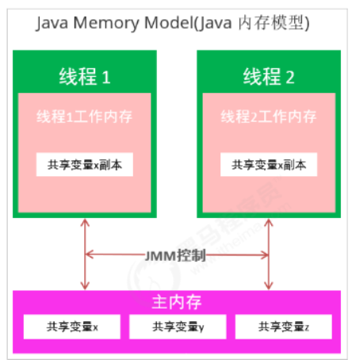
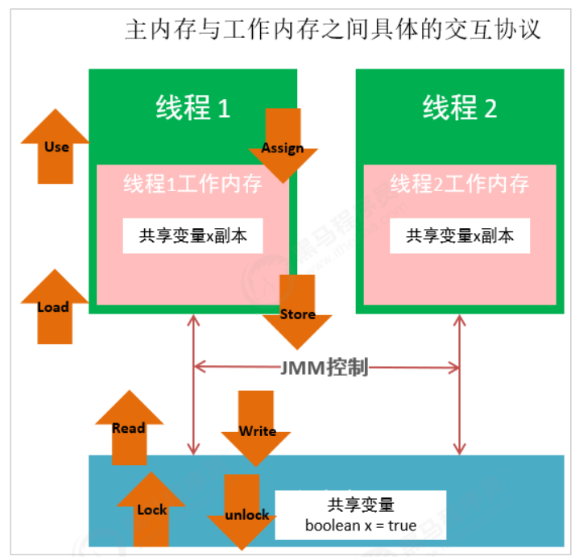
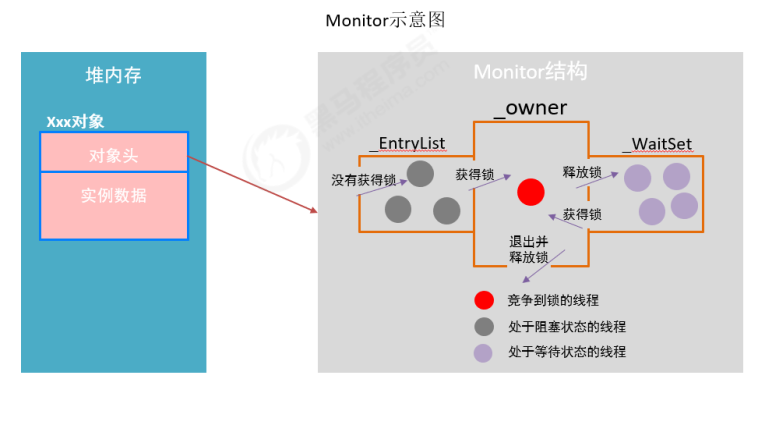

# 并发编程中的三个问题

==可见性（Visibility）==：是指一个线程对共享变量进行修改，另一个线程立即得到修改后的最新值 。

并发编程时，会出现可见性问题，当一个线程对共享变量进行了修改，另外的线程并没有立即看到修改后的最新值 

synchronized保证可见性的原理，执行synchronized时，会对应lock原子操作会刷新工作内存中共享变量的值 


==原子性（Atomicity）==：在一次或多次操作中，要么所有的操作都执行并且不会受其他因素干扰而中断，要么所有的操作都不执行。 

并发编程时，会出现原子性问题，当一个线程对共享变量操作到一半时，另外的线程也有可能来操作共享变量，干扰了前一个线程的操作。 

synchronized保证原子性的原理，synchronized保证只有一个线程拿到锁，能够进入同步代码块 


==有序性（Ordering）==：是指程序中代码的执行顺序，Java在编译时和运行时会对代码进行优化，会导致程序最终的执行顺序不一定就是我们编写代码时的顺序。 

程序代码在执行过程中的先后顺序，由于Java在编译期以及运行期的优化，导致了代码的执行顺序未必就是开发者编写代码时的顺序 。

synchronized保证有序性的原理，我们加synchronized后，依然会发生重排序，只不过，我们有同步
代码块，可以保证只有一个线程执行同步代码中的代码。保证有序性 


# Java内存模型

Java内存模型，是Java虚拟机规范中所定义的一种内存模型，Java内存模型是标准化的，屏蔽掉了底层不同计算机的区别。
Java内存模型是一套规范，描述了Java程序中各种变量(线程共享变量)的访问规则，以及在JVM中将变量存储到内存和从内存中读取变量这样的底层细节，具体如下。
==主内存==
主内存是所有线程都共享的，都能访问的。所有的共享变量都存储于主内存。
==工作内存==
每一个线程有自己的工作内存，工作内存只存储该线程对共享变量的副本。线程对变量的所有的操
作(读，取)都必须在工作内存中完成，而不能直接读写主内存中的变量，不同线程之间也不能直接
访问对方工作内存中的变量。 




### 作用

Java内存模型是一套在多线程读写共享数据时，对共享数据的可见性、有序性、和原子性的规则和保障。 


### CPU缓存，内存与Java内存模型的关系 

多线程的执行最终都会映射到硬件处理器上进行执行。
但Java内存模型和硬件内存架构并不完全一致。对于硬件内存来说只有寄存器、缓存内存、主内存的概
念，并没有工作内存和主内存之分，也就是说Java内存模型对内存的划分对硬件内存并没有任何影响，
因为==JMM只是一种抽象的概念，是一组规则，不管是工作内存的数据还是主内存的数据，对于计算机硬
件来说都会存储在计算机主内存中，当然也有可能存储到CPU缓存或者寄存器中==，因此总体上来说，
Java内存模型和计算机硬件内存架构是一个相互交叉的关系，是一种抽象概念划分与真实物理硬件的交
叉。 




### 主内存与工作内存之间的交互 



Java内存模型中定义了以下8种操作来完成，主内存与工作内存之间具体的交互协议，即一个变量如何
从主内存拷贝到工作内存、如何从工作内存同步回主内存之类的实现细节，虚拟机实现时必须保证下面
提及的每一种操作都是原子的、不可再分的。
对应如下的流程图：



注意:
1. 如果对一个变量执行lock操作，将会清空工作内存中此变量的值
2. 对一个变量执行unlock操作之前，必须先把此变量同步到主内存中 


主内存与工作内存之间的数据交互过程 

lock -> read -> load -> use -> assign -> store -> write -> unlock 


# synchronized特性

### 可重入特性 

一个线程可以多次执行synchronized，重复获取同一把锁。

**原理**

synchronized的锁对象中有一个计数器（recursions变量）会记录线程获得几次锁 

**好处**

1. 可以避免死锁
2. 可以让我们更好的来封装代码 

**小结**

synchronized是可重入锁，内部锁对象中会有一个计数器记录线程获取几次锁啦，在执行完同步代码块
时，计数器的数量会-1，直到计数器的数量为0，就释放这个锁。 


### 不可中断性

一个线程获得锁后，另一个线程想要获得锁，必须处于阻塞或等待状态，如果第一个线程不释放锁，第
二个线程会一直阻塞或等待，不可被中断。

**小结**

synchronized属于不可被中断
Lock的lock方法是不可中断的
Lock的tryLock方法是可中断的 


# synchronized原理


### monitorenter 

每一个对象都会和一个监视器monitor关联。监视器被占用时会被锁住，其他线程无法来获取该monitor。 当JVM执行某个线程的某个方法内部的monitorenter时，它会尝试去获取当前对象对应的monitor的所有权。其过程如下： 

1. 若monior的进入数为0，线程可以进入monitor，并将monitor的进入数置为1。当前线程成为monitor的owner（所有者）
2. 若线程已拥有monitor的所有权，允许它重入monitor，则进入monitor的进入数加1
3. 若其他线程已经占有monitor的所有权，那么当前尝试获取monitor的所有权的线程会被阻塞，直
  到monitor的进入数变为0，才能重新尝试获取monitor的所有权。 

**小结**

synchronized的锁对象会关联一个monitor,==这个monitor不是我们主动创建的,是JVM的线程执行到这个同步代码块,发现锁对象没有monitor就会创建monitor==,monitor内部有两个重要的成员变量owner:拥有这把锁的线程,recursions会记录线程拥有锁的次数,当一个线程拥有monitor后其他线程只能等待 


### monitorexit 

1. 能执行monitorexit指令的线程一定是拥有当前对象的monitor的所有权的线程。
2. 执行monitorexit时会将monitor的进入数减1。当monitor的进入数减为0时，当前线程退出
  monitor，不再拥有monitor的所有权，此时其他被这个monitor阻塞的线程可以尝试去获取这个
  monitor的所有权 


monitorexit释放锁。

monitorexit插入在方法结束处和异常处，JVM保证每个monitorenter必须有对应的monitorexit。


面试题synchroznied出现异常会释放锁吗?

会释放锁 


# 深入JVM源码


### monitor监视器锁 

可以看出无论是synchronized代码块还是synchronized方法，其线程安全的语义实现最终依赖一个叫monitor的东西，那么这个神秘的东西是什么呢？下面让我们来详细介绍一下。 

在HotSpot虚拟机中，monitor是由ObjectMonitor实现的。其源码是用c++来实现的，位于HotSpot虚
拟机源码ObjectMonitor.hpp文件中(src/share/vm/runtime/objectMonitor.hpp)。ObjectMonitor主
要数据结构如下： 


```c++
ObjectMonitor() {
_header = NULL;
_count = 0;
_waiters = 0，
_recursions = 0; // 线程的重入次数
_object = NULL; // 存储该monitor的对象
_owner = NULL; // 标识拥有该monitor的线程
_WaitSet = NULL; // 处于wait状态的线程，会被加入到_WaitSet
_WaitSetLock = 0 ;
_Responsible = NULL;
_succ = NULL;
_cxq = NULL; // 多线程竞争锁时的单向列表
FreeNext = NULL;
_EntryList = NULL; // 处于等待锁block状态的线程，会被加入到该列表
_SpinFreq = 0;
_SpinClock = 0;
OwnerIsThread = 0;
}
```


1. _owner：初始时为NULL。当有线程占有该monitor时，owner标记为该线程的唯一标识。当线程
  释放monitor时，owner又恢复为NULL。owner是一个临界资源，JVM是通过CAS操作来保证其线
  程安全的。
2. _cxq：竞争队列，所有请求锁的线程首先会被放在这个队列中（单向链接）。_cxq是一个临界资
  源，JVM通过CAS原子指令来修改_cxq队列。修改前_cxq的旧值填入了node的next字段，_cxq指
  向新值（新线程）。因此_cxq是一个后进先出的stack（栈）。
3. _EntryList：_cxq队列中有资格成为候选资源的线程会被移动到该队列中。
4. _WaitSet：因为调用wait方法而被阻塞的线程会被放在该队列中。 


每一个Java对象都可以与一个监视器monitor关联，我们可以把它理解成为一把锁，当一个线程想要执
行一段被synchronized圈起来的同步方法或者代码块时，该线程得先获取到synchronized修饰的对象
对应的monitor。
我们的Java代码里不会显示地去创造这么一个monitor对象，我们也无需创建，事实上可以这么理解：
monitor并不是随着对象创建而创建的。我们是通过synchronized修饰符告诉JVM需要为我们的某个对
象创建关联的monitor对象。每个线程都存在两个ObjectMonitor对象列表，分别为free和used列表。
同时JVM中也维护着global locklist。当线程需要ObjectMonitor对象时，首先从线程自身的free表中申
请，若存在则使用，若不存在则从global list中申请。
ObjectMonitor的数据结构中包含：_owner、_WaitSet和_EntryList，它们之间的关系转换可以用下图
表示 




